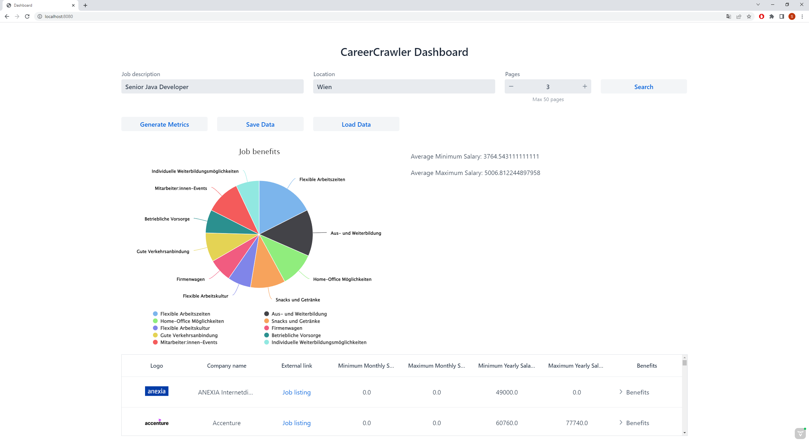

# CareerCrawler

CareerCrawler is a proof-of-concept project demonstrating how AI can be used to retrieve information from text and assist in creating new insights in data. 

* Job listings are extracted and put into a JMS queue
* Event based processing of job listings
* Usage of AI to retrieve data from job ad texts
* Creation of job metrics with the help of AI
* Display of results using the Vaadin framework

